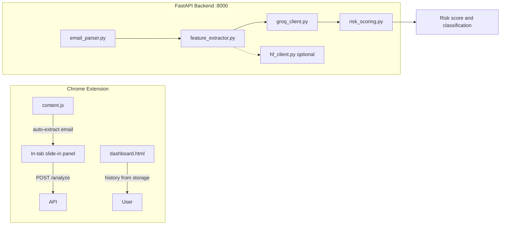

# PhishGuard AI

A full-stack phishing email analysis system with a **FastAPI** backend and **Chrome extension** frontend. Scan emails directly in Gmail or Outlook, paste raw email text, or call the API with structured fields. The backend extracts security features, analyzes content with **Groq LLM** (default), blends heuristic risk scoring, and returns a unified verdict with confidence and recommendations.

**Developer:** Saliha Zulfiqar · [GitHub](https://github.com/Saliha-Zulfiqar/IS_project) · [Fine-tuned model on Hugging Face](https://huggingface.co/omerfarooq223/phishing-detector-phi3-lora)

## What you get

| Capability | PhishGuard AI |
|------------|---------------|
| In-browser scanning | Gmail + Outlook floating button and in-tab analysis panel |
| Structured API | `sender`, `subject`, `body` JSON fields |
| Raw email paste | `raw_text` field for `.eml` / RFC 5322 source |
| AI analysis | Groq `llama-3.3-70b-versatile` with a 6-step analyst rubric |
| Heuristic layer | Urgency, URLs, trusted senders, brand impersonation vs reference |
| Risk scoring | Blended LLM + feature scores (graduated, not flat caps) |
| Dashboard | History, stats, threat intel, dark mode, settings |
| Optional local model | Phi-3 + LoRA via Hugging Face (`hf_client.py`, disabled by default) |

## Architecture



## Setup

### PyCharm / IntelliJ

1. Open this folder in PyCharm:

   ```text
   IS_project
   ```

2. Create the backend virtual environment:

   ```powershell
   cd backend
   python -m venv .venv
   .\.venv\Scripts\Activate.ps1
   pip install -r requirements.txt
   ```

   macOS/Linux:

   ```bash
   cd backend
   python3 -m venv .venv
   source .venv/bin/activate
   pip install -r requirements.txt
   ```

3. Copy environment template from the **project root**:

   ```powershell
   cd ..
   copy .env.example .env
   ```

4. In PyCharm, set the Python interpreter to:

   ```text
   backend/.venv/Scripts/python.exe    # Windows
   backend/.venv/bin/python            # macOS/Linux
   ```

5. Create a run configuration:

   | Setting | Value |
   |---------|-------|
   | Module name | `uvicorn` |
   | Parameters | `backend.main:app --host 0.0.0.0 --port 8000 --reload` |
   | Working directory | Project root (`IS_project/`) |

   Or use **Script path** `backend/main.py` with working directory `backend` (starts uvicorn on port 8000).

6. Load the Chrome extension:
   - Open `chrome://extensions/`
   - Enable **Developer mode** (top right)
   - Click **Load unpacked**
   - Select the `chrome-extension` folder in this repo
   - Pin **PhishGuard AI** from the puzzle icon in the toolbar

7. Open Gmail or Outlook:
   - Open any email
   - Click **Check for phishing** (bottom-right floating button)
   - The analysis panel slides in from the right in the same tab

### Backend

```powershell
cd backend
python -m venv .venv
.\.venv\Scripts\Activate.ps1
pip install -r requirements.txt
cd ..
copy .env.example .env
```

Edit `.env` at the project root. Do **not** commit `.env`.

```env
GROQ_API_KEY=gsk_your_groq_api_key_here
HF_TOKEN=hf_your_huggingface_token_here
```

`HF_TOKEN` is only needed if you enable the local Hugging Face model in `backend/main.py`.

Start the API from the **project root**:

```powershell
.\backend\.venv\Scripts\Activate.ps1
python -m uvicorn backend.main:app --host 0.0.0.0 --port 8000 --reload
```

| Endpoint | URL |
|----------|-----|
| Interactive docs | http://localhost:8000/docs |
| Health check | http://localhost:8000/health |
| Analyze | `POST http://localhost:8000/analyze` |

With Groq configured, `/health` returns `"status": "ok"` and `"groq_ready": true`. `"model_loaded": false` is expected unless you enable `hf_client`.

### Chrome extension

1. Open `chrome://extensions/`
2. Enable **Developer mode**
3. **Load unpacked** → select `chrome-extension/`
4. Pin the extension icon in the toolbar
5. Click the icon to open the **Security Dashboard** in a new tab
6. On Gmail/Outlook, use the floating **Check for phishing** button to scan the open email

**Panel controls:** close with ×, click the backdrop, or press `Esc`.

**Settings:** Dashboard → **Settings** → API URL (default `http://localhost:8000`), dark mode toggle, clear history.

## API keys

| Service | Required | Get a key |
|---------|----------|-----------|
| Groq | Yes (default backend) | https://console.groq.com |
| Hugging Face | No (local Phi-3 path only) | https://huggingface.co/settings/tokens |

## Test `/analyze`

### Structured fields

**Windows (PowerShell):**

```powershell
curl.exe -X POST http://localhost:8000/analyze `
  -H "Content-Type: application/json" `
  -d "{\"sender\":\"security@paypa1-verify.net\",\"subject\":\"URGENT: verify your PayPal account\",\"body\":\"Click now: http://192.168.0.99/secure/login/verify\"}"
```

**macOS/Linux:**

```bash
curl -X POST http://localhost:8000/analyze \
  -H "Content-Type: application/json" \
  -d '{"sender":"security@paypa1-verify.net","subject":"URGENT: verify your PayPal account","body":"Click now: http://192.168.0.99/secure/login/verify"}'
```

### Raw email text (like `.eml` paste)

```bash
curl -X POST http://localhost:8000/analyze \
  -H "Content-Type: application/json" \
  -d '{"raw_text":"From: Security <security@example.com>\nReply-To: help@other.example\nSubject: Urgent verify\n\nClick now: https://example.com/login"}'
```

### Automated test suites

```powershell
cd backend
.\.venv\Scripts\Activate.ps1
$env:PYTHONIOENCODING="utf-8"
python test_scoring.py
python test_api.py
```

`test_scoring.py` runs offline (no API key). `test_api.py` hits the live server with 8 sample emails.

## Command reference

### Backend

| Task | Command |
|------|---------|
| Create virtual environment | `python -m venv backend/.venv` |
| Activate (Windows) | `backend\.venv\Scripts\Activate.ps1` |
| Activate (macOS/Linux) | `source backend/.venv/bin/activate` |
| Install dependencies | `pip install -r backend/requirements.txt` |
| Start API (from project root) | `python -m uvicorn backend.main:app --host 0.0.0.0 --port 8000 --reload` |
| Offline scoring tests | `cd backend && python test_scoring.py` |
| Live API tests | `cd backend && python test_api.py` |

### Chrome extension

No build step — vanilla HTML, CSS, and JavaScript.

| Task | Steps |
|------|-------|
| Reload after code changes | `chrome://extensions/` → **PhishGuard AI** → Reload |
| Inspect dashboard | Right-click the dashboard tab → **Inspect** |
| Inspect in-tab panel | Open Gmail, open the panel, use DevTools on the parent page |
| Inspect background worker | `chrome://extensions/` → **Service worker** under PhishGuard AI |
| Regenerate icons | `cd chrome-extension && python generate_icons.py` |

### Analysis history (browser storage)

History is stored in `chrome.storage.local` (up to 100 scans), not a server database.

1. Open the dashboard → **Settings** or use DevTools on the extension dashboard
2. **Application** tab → **Storage** → **Extension storage** → select PhishGuard AI
3. View the `analysis_history` key

To clear history: Dashboard → **Settings** → **Clear All Data**, or History tab → **Clear all**.

## Response shape

`POST /analyze` returns:

```json
{
  "classification": "PHISHING",
  "risk_score": 78,
  "risk_level": "HIGH",
  "confidence": "HIGH",
  "reasons": "Sender domain does not match PayPal. Suspicious URL uses an IP address...",
  "recommendation": "Do NOT click any links. Delete this email immediately.",
  "features": {
    "sender_email_parsed": "security@paypa1-verify.net",
    "urgency_score": 3,
    "effective_urgency_score": 3,
    "urgency_words": ["urgent", "verify your account"],
    "url_count": 1,
    "suspicious_url_count": 1,
    "all_urls_trusted": false,
    "is_trusted_sender": false,
    "domain_mismatch": {
      "has_mismatch": true,
      "mismatched_brands": ["paypal"],
      "referenced_brands": []
    },
    "is_google_service_notification": false
  }
}
```

**Risk levels**

| Risk score | Level | Recommendation |
|------------|-------|----------------|
| 75 or above | HIGH | Do not click links; delete email |
| 45–74 | MEDIUM | Proceed with caution; verify sender |
| Below 45 | LOW | Appears safe |

**Key `features` fields**

| Field | Description |
|-------|-------------|
| `is_trusted_sender` | Sender domain matches a known official brand domain |
| `all_urls_trusted` | Every URL points to a trusted host |
| `domain_mismatch.has_mismatch` | Brand **impersonation** (not casual mentions) |
| `domain_mismatch.referenced_brands` | Brands mentioned in integration/settings context |
| `is_google_service_notification` | Google Classroom, policy, account, or Workspace patterns |
| `effective_urgency_score` | Urgency discounted for verified senders |

### `GET /health`

```json
{
  "status": "ok",
  "model": "Groq API (no fine-tuned model)",
  "model_loaded": false,
  "groq_ready": true
}
```

## Classification pipeline

1. **Parse** — structured fields or `raw_text` MIME source
2. **Heuristic features** — urgency, URLs, trusted hosts, impersonation detection
3. **Groq LLM** — structured analyst rubric with sender/URL/urgency context
4. **Risk scoring** — blends LLM and feature scores; classification aligned to evidence

### False-positive safeguards

| Scenario | Handling |
|----------|----------|
| Google Classroom / policy / account mail from `@google.com` | Verified sender + official URLs → LEGITIMATE, low graduated score |
| Verified brand senders with clean URLs | LEGITIMATE, score varies by context |
| Vendor mail mentioning “Google settings” (e.g. Smile.io) | Brand *reference*, not impersonation → LEGITIMATE |
| Actual impersonation or malicious URLs | PHISHING, elevated score |

## Environment variables

| Variable | Required | Description |
|----------|----------|-------------|
| `GROQ_API_KEY` | Yes (default) | Groq API key for LLM analysis |
| `HF_TOKEN` | No | Hugging Face token for optional local Phi-3 + LoRA path |

## Project structure

```text
IS_project/
├── backend/
│   ├── main.py              # FastAPI app
│   ├── email_parser.py      # Raw email / .eml text parsing
│   ├── feature_extractor.py # Heuristics and impersonation detection
│   ├── groq_client.py       # Groq LLM inference
│   ├── risk_scoring.py      # Blended risk scoring
│   ├── hf_client.py         # Optional Phi-3 + LoRA
│   ├── test_api.py          # Live API integration tests
│   ├── test_scoring.py      # Offline scoring tests
│   └── requirements.txt
├── chrome-extension/
│   ├── manifest.json
│   ├── background.js        # Toolbar icon → dashboard
│   ├── content.js           # Gmail/Outlook inject + in-tab panel
│   ├── popup.html/js/css    # Analysis UI (embedded in panel)
│   ├── dashboard.html/js/css
│   ├── theme.js/css         # Dark mode
│   ├── generate_icons.py
│   └── icon*.png
├── .env.example
├── README.md
└── SECURITY.md
```

## Prerequisites

- Python 3.10+
- Google Chrome
- Groq API key ([console.groq.com](https://console.groq.com))
- Hugging Face account — only for optional local model (~8 GB disk on first download)

## Notes

- After backend changes, restart uvicorn and reload the extension at `chrome://extensions/`.
- The extension only requests `host_permissions` for `http://localhost:8000/*`.
- Email content goes to your **local backend**; the default backend forwards prompts to Groq — see [SECURITY.md](SECURITY.md).
- CPU PyTorch is pinned for lighter installs; local inference is slower without GPU.

## License

Academic / project use — add your course or institutional license as required.
