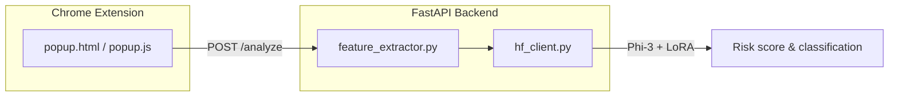

# PhishGuard AI

AI-powered phishing email detection with heuristic feature extraction, a fine-tuned **Phi-3-mini LoRA** model, and a Chrome extension popup for manual analysis.

## Architecture



| Layer | Role |
|-------|------|
| **Chrome extension** | Paste or future auto-capture of email fields; calls local API |
| **feature_extractor.py** | Urgency keywords, URLs, domain mismatch, HTML signals |
| **hf_client.py** | Loads `microsoft/Phi-3-mini-4k-instruct` + LoRA adapter from Hugging Face |
| **groq_client.py** | Optional cloud LLM path (not used by default `main.py`) |

## Prerequisites

- **Python 3.10+**
- **Google Chrome** (for the extension)
- **Hugging Face account** with access to:
  - [microsoft/Phi-3-mini-4k-instruct](https://huggingface.co/microsoft/Phi-3-mini-4k-instruct)
  - [omerfarooq223/phishing-detector-phi3-lora](https://huggingface.co/omerfarooq223/phishing-detector-phi3-lora)
- **~8 GB disk** for first-time model download (CPU weights)

## Quick start

### 1. Clone and configure

```bash
git clone <your-repo-url>
cd IS_project
copy .env.example .env   # Windows
# cp .env.example .env   # macOS/Linux
```

Edit `.env` and set `HF_TOKEN` (see `.env.example`). Do **not** commit `.env`.

### 2. Backend

```bash
cd backend
python -m venv .venv
.\.venv\Scripts\Activate.ps1
# macOS/Linux
# source .venv/bin/activate

pip install -r requirements.txt
# Choose backend mode:
# 1️⃣ Local fine‑tuned model (HF) – requires HF_TOKEN
#    Set your Hugging Face token and run:
#    echo HF_TOKEN=your_hf_token >> .env   # or edit .env manually
#
# 2️⃣ Groq API – requires GROQ_API_KEY
#    Set your Groq key and run:
#    echo GROQ_API_KEY=your_groq_key >> .env   # or edit .env manually
#
# Then start the server (will pick the appropriate client based on which key is present):
python main.py
```
```bash
# Run the backend (will select HF or Groq based on environment variables)
python -m uvicorn backend.main:app --host 0.0.0.0 --port 8000
```


Wait until the server logs **Model loaded successfully.** The first run can take several minutes while weights download.

- API docs: http://localhost:8000/docs  
- Health: http://localhost:8000/health → `"model_loaded": true`

### 3. Run API tests (optional)

In a second terminal:

```bash
cd backend
.\.venv\Scripts\Activate.ps1
python test_api.py
```

### 4. Chrome extension

1. Open `chrome://extensions`
2. Enable **Developer mode**
3. **Load unpacked** → select the `chrome-extension` folder
4. After loading the extension, a fixed “Analyze with PhishGuard” button appears in Gmail/Outlook (bottom‑right). Click it to open a modal overlay that automatically analyzes the currently open email.

Ensure the backend stays on **http://localhost:8000**.

## API

### `POST /analyze`

```json
{
  "sender": "alert@example.com",
  "subject": "URGENT: verify your account",
  "body": "Click here to verify..."
}
```

**Response:** `classification`, `risk_score` (0–100), `risk_level` (HIGH/MEDIUM/LOW), `reasons`, `confidence`, `features`, `recommendation`

| Risk score | Level | Recommendation |
|------------|-------|----------------|
| ≥ 75 | HIGH | Do not click links; delete email |
| 45–74 | MEDIUM | Proceed with caution; verify sender |
| &lt; 45 | LOW | Appears safe |

### `GET /health`

Returns `status`, `model`, and `model_loaded`.

## Environment variables

| Variable | Required | Description |
|----------|----------|-------------|
| `HF_TOKEN` | Yes (default app) | Hugging Face read token |
| `GROQ_API_KEY` | No | Only if using `groq_client` instead of `hf_client` |

## Project structure

```
IS_project/
├── backend/
│   ├── main.py              # FastAPI app
│   ├── feature_extractor.py # Heuristic features
│   ├── hf_client.py         # Phi-3 + LoRA inference
│   ├── groq_client.py       # Optional Groq API
│   ├── test_api.py          # Sample requests
│   └── requirements.txt
├── chrome-extension/
│   ├── manifest.json
│   ├── popup.html / popup.js / style.css
│   ├── content.js
│   └── icon*.png
├── scripts/
│   └── generate_icons.py
├── .env.example
└── README.md
```

## Regenerate extension icons

```bash
python scripts/generate_icons.py
```

## Notes

- `phishing_detector_FINAL.zip` is **gitignored**; the app pulls the LoRA adapter from Hugging Face Hub.
- CPU PyTorch is pinned for a lighter install; inference is slower than GPU but needs no CUDA.
- Gmail/Outlook auto-extract in `content.js` is a stub for future work.

## License

Academic / project use — add your course or institutional license as required.
